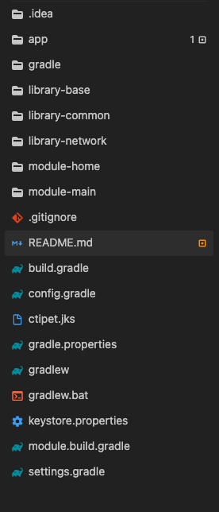
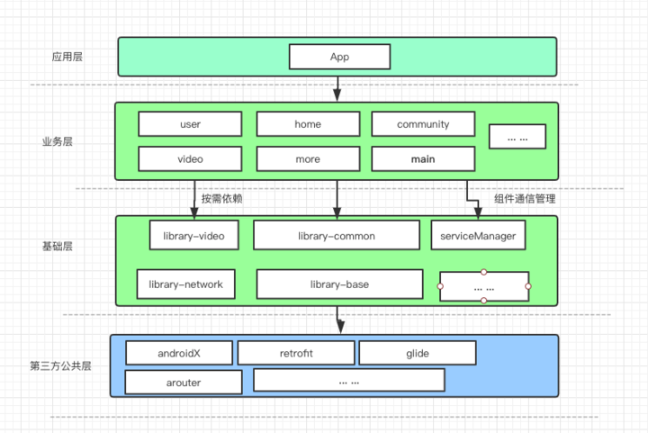
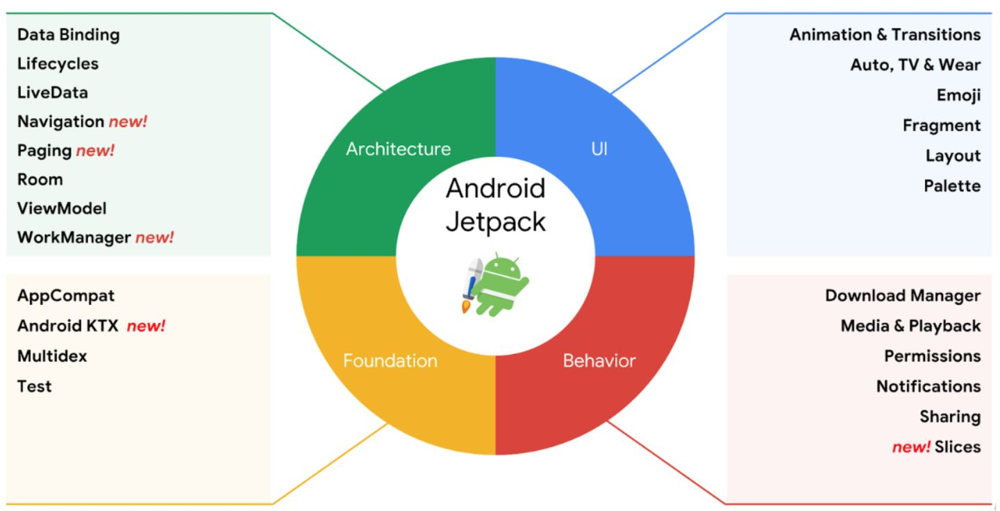

# 安卓MVVM架构项目模板

## 项目结构
该开源项目采用组件化的方式开发，使用MVVM + AndroidX + Jetpack 组件为基本架构进行开发。

- 项目结构图

- App 架构图

## App 使用技术介绍

- MVVM 架构设计

[Android Jetpack 应用架构设计指南](hhttps://developer.android.com/jetpack/guide)

- Android X 
[官方介绍](https://developer.android.google.cn/jetpack/androidx) ；

- Jetpack

[Jetpack 官方介绍](https://developer.android.google.cn/jetpack)

Jetpack概览

## app 第三方的依赖

- RxEasyHttp
 RxEasyHttp是一款github上开源的RxJava2+Retrofit2实现简单易用的网络请求框架，在本人发现并观摩其源码和设计原理后，发现着实写的不错，各种业务场景基本都设计到了，api 设计的也不错，当然也存在一些瑕疵，所以实际项目中还需根据自己的业务需求进行二次开发，推荐给各位看官[RxEasyHttp](https://github.com/darryrzhong/RxEasyHttp)

- Loadsir
loadsir是一个app 页面状态管理的第三方库，也非常得实用，用来控制app 内的加载页面 、加载错误页面、空页面显示，点击重试等，从此告别自己控制网络加载失败等页面 show 、 hint 操作 和ViewStub等的控制，
可以基于自己的业务进行基类封装，具体请看项目base库中activity 和fragment 基类的封装。推荐给各位看官
[Loadsir](https://github.com/darryrzhong/LoadSir/blob/master/README-cn.md
)

- mmkv 
mmkv 是腾讯开源的一个轻量级的存储库，用来代替SharedPreferences 再好不过了，具体使用请看官方介绍

- BaseRecyclerViewAdapterHelper
相信对于这个库大家应该是非常熟悉了吧，基本做android 开发的都用过吧，不多说了

- SmartRefreshLayout
这个库和上面那个库一样，用的非常多，

- immersionbar
实现沉浸式状态栏的一个第三方库，也是非常常用

- glide
图片加载库

- rxpermissions 
权限加载库

- logger
日志打印库，打出来的日志格式看得比较舒服

- utilcodex
一个android 工具库，里面有非常多的工具类，当然实际项目用不到这么多，所以可以根据需求copy代码就好，不用集成

- BannerViewPager
一个第三方轮播图的库，这个库比较新，所以start数比较少，但是挺好用，推荐

- PagerBottomTabStrip
一个第三方导航库，app中的底部导航就是基于这个库，挺好用，自带小红点管理

- gsyVideoPlayer
一个第三方视频播放库，基于bilibili 开源的 ijkplayer，可自定义性也还不错，
主要使用这个库实现类似微博等视频列表根据滚动判断自动播放

## 学习更多🔭
[Gradle Implementation vs API configuration](https://stackoverflow.com/questions/44413952/gradle-implementation-vs-api-configuration)