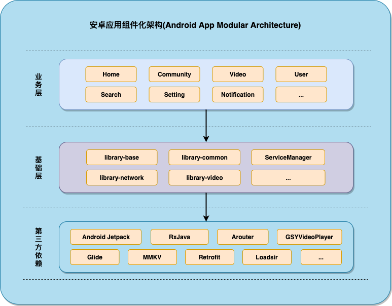
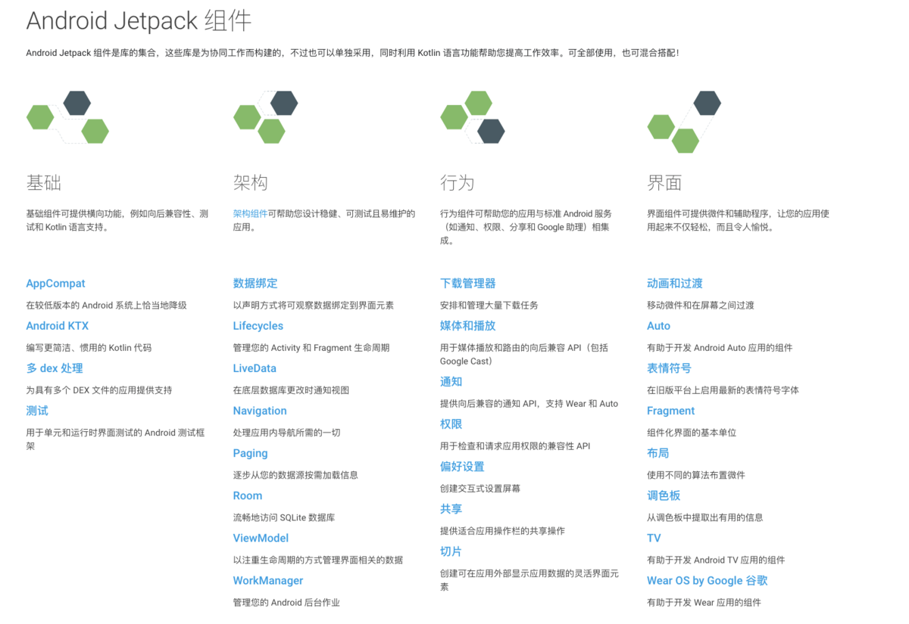

# 安卓MVVM架构项目模板

## 项目结构
该开源项目采用组件化的方式开发，使用MVVM + AndroidX + Jetpack 组件为基本架构进行开发。

- 项目结构图

- App 架构图

## App 使用技术介绍

- MVVM 架构设计

[Android Jetpack 应用架构设计指南](https://developer.android.com/jetpack/guide)

- Android X
[官方介绍](https://developer.android.google.cn/jetpack/androidx) ；

- Jetpack

[Jetpack 官方介绍](https://developer.android.google.cn/jetpack)

Jetpack概览

## App 第三方的依赖

- [RxEasyHttp](https://github.com/darryrzhong/RxEasyHttp)

 RxEasyHttp是一款github上开源的RxJava2+Retrofit2实现简单易用的网络请求框架，在本人发现并观摩其源码和设计原理后，发现着实写的不错，
 各种业务场景基本都设计到了，api 设计的也不错，当然也存在一些瑕疵，所以实际项目中还需根据自己的业务需求进行二次开发.

- [Loadsir](https://github.com/KingJA/LoadSir)
loadsir是一个app 页面状态管理的第三方库，也非常得实用，用来控制app 内的加载页面 、加载错误页面、空页面显示，
点击重试等，从此告别自己控制网络加载失败等页面 show 、 hint 操作 和ViewStub等的控制，
可以基于自己的业务进行基类封装，具体请看项目base库中activity 和fragment 基类的封装。

- [MMKV](https://github.com/Tencent/MMKV)

MMKV 是腾讯开源的一个轻量级的存储库，是基于 mmap 内存映射的 key-value 组件，底层序列化/反序列化使用 protobuf 实现 具体使用请看官方介绍

- BaseRecyclerViewAdapterHelper

相信对于这个库大家应该是非常熟悉了吧，基本做android 开发的都用过吧，不多说了

- [SmartRefreshLayout](https://github.com/scwang90/SmartRefreshLayout)

🔥下拉刷新、上拉加载、二级刷新、淘宝二楼、RefreshLayout、OverScroll，Android智能下拉刷新框架，支持越界回弹、越界拖动，具有极强的扩展性，集成了几十种炫酷的Header和 Footer。

- [ImmersionBar](https://github.com/gyf-dev/ImmersionBar)

android 4.4以上沉浸式状态栏和沉浸式导航栏管理，适配横竖屏切换、刘海屏、软键盘弹出等问题，可以修改状态栏字体颜色和导航栏图标颜色，
以及不可修改字体颜色手机的适配，适用于Activity、Fragment、DialogFragment、Dialog，PopupWindow

- [glide](https://github.com/bumptech/glide)

Glide是一个快速高效的Android图片加载库，注重于平滑的滚动。Glide提供了易用的API，高性能、可扩展的图片解码管道（decode pipeline），以及自动的资源池技术

- [RxPermissions](https://github.com/tbruyelle/RxPermissions)

基于RxJava的权限加载库

- [logger](https://github.com/orhanobut/logger)

安卓简单强大的日志打印工具

- [Android Util Code](https://github.com/Blankj/AndroidUtilCode)

常用安卓工具代码，[Android开发人员不得不收集的代码(持续更新中)](https://blankj.com/2016/07/31/android-utils-code/)

- [BannerViewPager](https://github.com/zhpanvip/BannerViewPager)

ViewPager轮播图，简单、高效，一行代码实现循环轮播，一屏三页任意变，指示器样式任你挑

- [GSYVideoPlayer](https://github.com/CarGuo/GSYVideoPlayer)

视频播放器（IJKplayer、ExoPlayer、MediaPlayer），HTTPS，支持弹幕，外挂字幕，支持滤镜、水印、gif截图，片头广告、中间广告，多个同时播放，
支持基本的拖动，声音、亮度调节，支持边播边缓存，支持视频自带rotation的旋转（90,270之类），重力旋转与手动旋转的同步支持，支持列表播放，
列表全屏动画，视频加载速度，列表小窗口支持拖动，动画效果，调整比例，多分辨率切换，支持切换播放器，进度条小窗口预览，列表切换详情页面无缝播放，rtsp、concat、mpeg。

- [Robolectric](https://github.com/robolectric/robolectric)

安卓单元测试框架

## 学习更多🔭

[Gradle Implementation vs API configuration](https://stackoverflow.com/questions/44413952/gradle-implementation-vs-api-configuration)

[Java基础 ：反射、注解、代理、线程池、依赖的学习和理解](https://www.jianshu.com/p/8da24b7cf443)

[Android Handler机制](https://segmentfault.com/a/1190000022843928)

[Android Jetpack框架之LiveData与ViewModel](https://www.jianshu.com/p/349642a79e89)

[Android单元测试研究与实践](https://tech.meituan.com/2015/12/24/android-unit-test.html)

[Android组件化方案及组件消息总线modular-event实战](https://tech.meituan.com/2018/12/20/modular-event.html)
